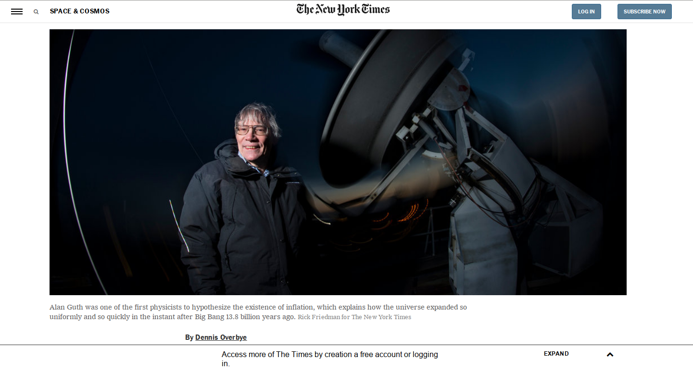

# Positioning And Floating Flements

> This project consists of building an HTML document that matches the appearance of New York Times Post([Original project link](https://www.nytimes.com/2014/03/18/science/space/detection-of-waves-in-space-buttresses-landmark-theory-of-big-bang.html?_r=0)

## Built With

- HTML,
- CSS,

## Live Demo

[Live Demo Link](https://rawcdn.githack.com/sipe-daniel/positioning-and-floating-elements/bf7e702e67e23bd027e8abe05b61c49252de1bce/index.html)

## Authors

👤 **Mauricio Santos**

- Github: [@githubhandle](https://github.com/maosan132)
- Linkedin: [linkedin](https://www.linkedin.com/in/mauricio-santos-a7292910/?originalSubdomain=co)

👤 **Daniel Jordan Sipe Tchawou**

- Github: [@githubhandle](https://github.com/sipe-daniel)
- Linkedin: [linkedin](https://linkedin.com/in/daniel-jordan-sipe-tchawou)

## 🤝 Contributing

Contributions, issues and feature requests are welcome!

Feel free to check the [issues page](issues/).

## Show your support

Give a ⭐️ if you like this project!

## Acknowledgments

- Hat tip to anyone whose code was used
- Inspiration
- etc

## 📝 License

This project is [MIT](lic.url) licensed.
